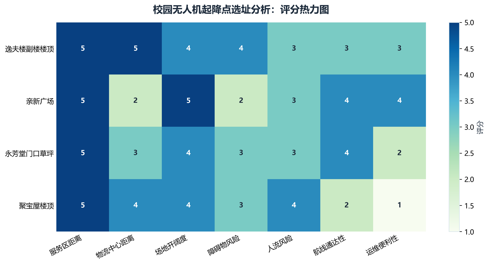
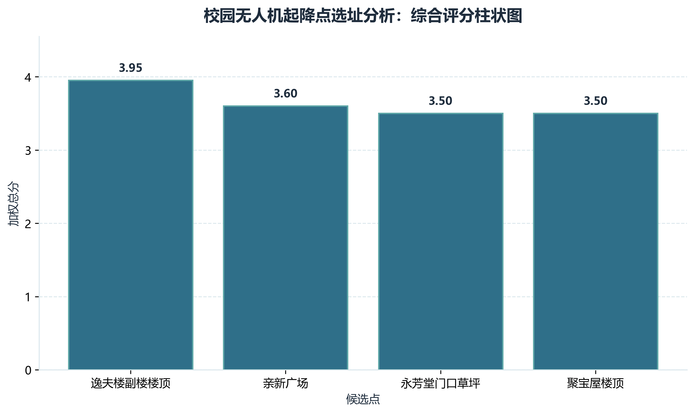
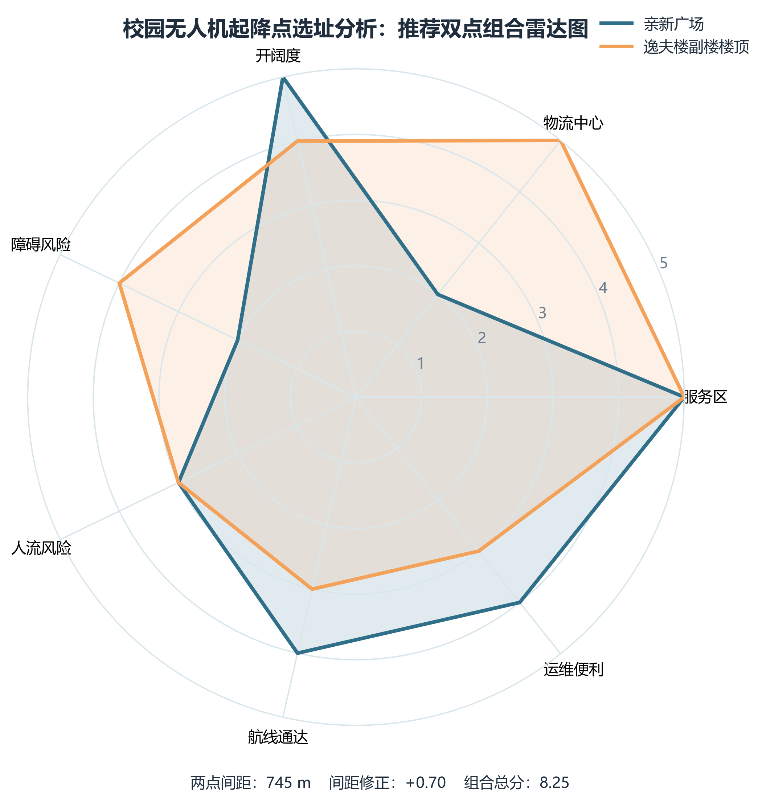

# 分析结果

本文档展示本次校园无人机起降点选址分析项目生成的 3 张结果图，用于从不同角度观察候选点的评分表现、单点排序结果和最终双点组合推荐。

## 1. 评分热力图

热力图展示了所有候选点在 7 个评价指标上的原始评分情况。颜色越深表示得分越高，便于快速比较不同候选点在各指标上的优势与短板。

## 2. 综合评分柱状图

柱状图展示了各候选点的加权总分，并按照总分从高到低进行排序。该图可以直观反映最终排名结果和不同候选点之间的综合差距。

## 3. 推荐双点组合雷达图

雷达图选取最终推荐双点组合中的两个候选点，对比它们在 7 个评价指标上的表现。图中同时标注了两点间距、间距修正和组合总分，适合用于解释为什么该组合比简单选择“单点评分前二”更合理。

## 结果说明

通过以上三张图，可以从以下三个层面理解本次分析结果：

- 热力图用于观察单项指标评分分布
- 柱状图用于展示单点评分和基础排序
- 雷达图用于比较最终推荐双点组合的结构性差异

这三种结果展示方式相互补充，可以帮助更全面地理解候选起降点的优劣。

## 最终排名表

根据当前输入数据计算得到的综合评分结果如下：

| 排名 | 候选点 | 综合得分 |
| --- | --- | ---: |
| 1 | 逸夫楼副楼楼顶 | 3.95 |
| 2 | 亲新广场 | 3.60 |
| 3 | 永芳堂门口草坪 | 3.50 |
| 4 | 聚宝屋楼顶 | 3.50 |

说明：

- 综合得分按照加权评分模型计算，并统一保留两位小数
- 若出现相同分数，则表示这些候选点在当前评分与权重设置下综合表现接近

## 最终推荐双点组合

在加入候选点间距修正后，本项目当前推荐的双点组合为：

| 推荐组合 | 基础组合分 | 两点间距 | 间距修正 | 最终组合分 |
| --- | ---: | ---: | ---: | ---: |
| 亲新广场 + 逸夫楼副楼楼顶 | 7.55 | 745 m | +0.70 | 8.25 |

补充说明：

- `基础组合分` 等于两个候选点的单点评分之和
- `间距修正` 用于惩罚过近组合、鼓励覆盖范围更开的组合
- 在当前这组最新距离数据下，单点评分前两名之间的间距也最大，因此获得了最高组合分

